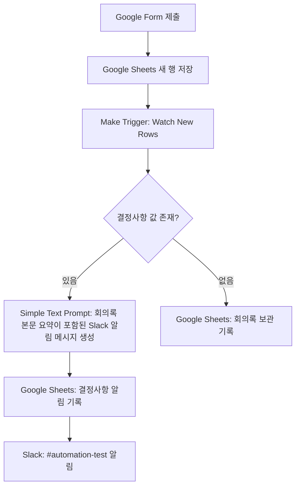

# 프로젝트 2 기획서: 회의록 요약 및 결정사항 알림 자동화

## 1. 프로젝트 개요

이 프로젝트는 회의 후 담당자가 회의록을 Google Form에 입력하면, Make가 새 응답을 감지해 결정사항 존재 여부에 따라 기록과 알림 흐름을 자동으로 나누는 워크플로우를 설계한다.

회의에서 결정된 내용이 있는 경우에는 AI가 Slack 공유용 요약문을 생성하고, Google Sheets 기록과 Slack 알림을 실행한다. 결정사항이 없는 경우에는 불필요한 AI 실행과 알림을 생략하고 회의록 보관 기록만 남긴다.

이번 문서는 프로젝트 2의 기획서 전용 산출물이다. `MISSION.md`의 최종 완료 조건인 실제 자동 실행 구현, 구현 화면 캡처, 실행 결과 화면 캡처는 후속 구현 PR에서 별도로 제출한다.

## 2. 업무 시나리오

팀 회의가 끝난 뒤 회의 진행자 또는 담당자는 회의명, 회의일시, 참석자, 회의록 본문, 결정사항, 후속작업, 담당자를 Google Form에 입력한다. Google Form 응답은 Google Sheets에 새 행으로 저장된다.

기존 수작업 흐름에서는 담당자가 회의록을 다시 읽고, 결정사항이 있는지 확인한 뒤, Slack 공유용 메시지를 작성하고, 별도 관리 시트에 기록해야 한다. 이 과정은 회의마다 반복되며, 결정사항이 없는 회의에도 같은 확인 작업이 발생한다.

자동화 워크플로우는 새 회의록 행을 감지한 뒤 결정사항이 있는 회의만 Slack 알림 대상으로 분류한다. 결정사항이 있는 회의는 AI 요약과 Slack 알림까지 진행하고, 결정사항이 없는 회의는 보관 기록으로만 처리한다.

## 3. 자동화 주제

**주제:** 회의록 요약 및 결정사항 알림 자동화

**목적:** 회의 후 반복되는 결정사항 확인, 공유 메시지 작성, 기록 업무를 자동화해 회의 후속작업 전달 누락을 줄인다.

**선정 도구:** Make

**알림 채널:** 정상 처리 결과는 Slack `#automation-test`, 실패 알림은 Gmail

**이번 PR 범위:** 워크플로우 설계 문서 작성

**후속 PR 범위:** Make 실제 구현, 구현 화면 캡처, 분기별 실행 결과 화면 캡처

## 4. 도구 선정 이유

Make를 선정한 이유는 프로젝트 2의 조건 분기와 무료 플랜 우선 제약에 적합하기 때문이다.

| 기준 | Make 선정 이유 |
| --- | --- |
| 조건 분기 | Router와 filter로 결정사항 있음/없음 경로를 시각적으로 분리할 수 있다. |
| 무료 플랜 | 공식 가격 문서 기준 Free 플랜에서 1,000 credits/month, Routers & filters, 15-minute minimum interval을 제공한다. |
| Google Sheets 연동 | Google Sheets의 새 행을 감지하고 분기별 기록 탭에 행을 추가하는 구성이 가능하다. |
| Slack 연동 | 결정사항이 있는 회의만 Slack 채널로 알림을 보낼 수 있다. |
| AI Action | Simple Text Prompt를 사용해 Slack 공유용 요약문을 생성할 수 있다. |
| 실행 확인 | 실행 이력에서 각 모듈의 입력값, 출력값, 오류를 확인할 수 있어 후속 구현 검증에 적합하다. |

## 5. 무료 플랜 사용 정책

모든 구현은 유료 플랜 없이 진행하는 것을 전제로 한다.

Make Free 플랜 범위 안에서 실습 가능하도록 다음 제약을 적용한다.

| 항목 | 적용 기준 |
| --- | --- |
| 월 사용량 | Free 플랜의 1,000 credits/month 안에서 테스트한다. |
| 실행 간격 | Free 플랜의 15-minute minimum interval을 전제로 한다. |
| 조건 분기 | Free 플랜에 포함된 Routers & filters를 사용한다. |
| AI 연결 방식 | OpenAI API Key를 직접 연결하는 Custom AI provider connection은 사용하지 않는다. |
| AI 모듈 | Make Simple Text Prompt의 automatic provider connection 방식으로 구성한다. |
| AI 실행 제한 | 결정사항이 있는 회의에만 AI 요약을 실행해 credits 사용을 줄인다. |

AI 실행은 무료 무제한 기능이 아니라 Make credits를 소모하는 기능으로 본다. 따라서 후속 구현 PR에서는 Simple Text Prompt 실행 결과와 함께 credit 사용량 또는 무료 플랜 제한을 확인할 수 있는 화면을 캡처해 문서화한다.

참고 공식 문서:

- [Make pricing](https://www.make.com/en/pricing)
- [Make credits](https://help.make.com/credits)
- [Simple Text Prompt](https://www.make.com/en/blog/simple-text-prompt-module)
- [Make Router](https://help.make.com/router)
- [Google Sheets modules](https://apps.make.com/google-sheets-modules)
- [OpenAI modules](https://apps.make.com/openai-modules)
- [Incomplete executions](https://help.make.com/incomplete-executions)

## 6. 입력 데이터

Google Form은 회의 후 담당자가 입력하는 회의록 접수 폼으로 설정한다. 응답은 Google Sheets의 원본 응답 탭에 저장된다.

| 필드 | 설명 |
| --- | --- |
| 회의명 | 회의 제목 |
| 회의일시 | 회의가 진행된 날짜와 시간 |
| 참석자 | 회의 참석자 목록 |
| 회의록 본문 | 논의 내용 전체 또는 핵심 메모 |
| 결정사항 | 회의에서 확정된 결정 내용. 없으면 비워 둔다. |
| 후속작업 | 결정사항과 연결된 해야 할 일. 없으면 비워 둔다. |
| 담당자 | 후속작업 담당자. 없으면 비워 둔다. |

## 7. 워크플로우 구조

후속 구현에서는 Make 시나리오를 다음 흐름으로 구성한다.

1. 담당자가 Google Form에 회의록을 입력한다.
2. Google Form 응답이 Google Sheets에 새 행으로 저장된다.
3. Make의 `Google Sheets > Watch New Rows` Trigger가 새 행을 감지한다.
4. Router에서 `결정사항` 값이 비어 있는지 확인한다.
5. 결정사항이 있으면 AI 요약, Google Sheets 기록, Slack 알림을 실행한다.
6. 결정사항이 없으면 AI 요약과 Slack 알림 없이 Google Sheets 보관 기록만 실행한다.



## 8. 조건 분기

Router는 `결정사항` 필드의 공백 여부를 기준으로 두 경로를 나눈다.

| 분기 | 조건 | 처리 의미 |
| --- | --- | --- |
| 결정사항 있음 | `결정사항` 값이 비어 있지 않음 | 팀에 공유해야 하는 확정 내용이 있으므로 AI 요약과 Slack 알림을 실행한다. |
| 결정사항 없음 | `결정사항` 값이 비어 있음 | 공유할 확정 내용이 없으므로 회의록 보관 기록만 남긴다. |

조건 판단 시 공백만 입력된 값을 결정사항으로 처리하지 않도록 후속 구현에서 앞뒤 공백을 제거한 값 기준으로 설정한다.

## 9. 분기별 처리 흐름

### 결정사항 있음

- Make `Simple Text Prompt`로 회의록 본문 요약이 포함된 Slack 알림 메시지를 생성한다.
- Google Sheets의 `결정사항 알림 기록` 탭에 회의명, 회의일시, 참석자, 결정사항, 후속작업, 담당자, AI 알림 메시지를 추가한다.
- Slack `#automation-test` 채널에 결정사항 알림 메시지를 전송한다.

### 결정사항 없음

- Make AI 모듈을 실행하지 않는다.
- Slack 알림을 전송하지 않는다.
- Google Sheets의 `회의록 보관 기록` 탭에 회의명, 회의일시, 참석자, 회의록 본문을 추가한다.

## 10. AI 요약 Action

AI Action은 Make `Simple Text Prompt` 모듈로 구성한다. Custom AI provider connection이나 별도 OpenAI API Key는 사용하지 않는다.

요약 프롬프트는 Slack 공유에 바로 사용할 수 있는 짧은 업무 메시지에 회의록 본문 요약과 결정사항 알림을 함께 담도록 설계한다.

```text
다음 회의록 정보를 바탕으로 Slack에 공유할 결정사항 알림 메시지를 작성해 주세요.

조건:
- 한국어로 작성합니다.
- Slack 메시지는 "회의 정보", "회의록 본문 요약", "결정사항", "후속작업/담당자" 섹션으로 구성합니다.
- 회의 정보에는 회의명, 회의일시, 참석자를 포함합니다.
- 회의록 본문 요약은 회의록 본문을 근거로 주요 논의 배경, 쟁점, 합의 또는 미결 내용을 3개 이하 bullet로 요약합니다.
- 결정사항은 3개 이하 bullet로 요약하되, 회의록 본문 요약과 구분합니다.
- 결정사항 필드에 직접 적히지 않았지만 회의록 본문에서 중요한 내용은 회의록 본문 요약에 포함합니다.
- 후속작업과 담당자가 비어 있으면 "후속작업: 없음"으로 표시합니다.
- 민감정보나 계정정보가 있다면 그대로 노출하지 말고 요약합니다.

회의명: {{회의명}}
회의일시: {{회의일시}}
참석자: {{참석자}}
회의록 본문: {{회의록 본문}}
결정사항: {{결정사항}}
후속작업: {{후속작업}}
담당자: {{담당자}}
```

## 11. 실패 알림 및 재시도 전략

후속 구현에서는 `Simple Text Prompt`, Google Sheets 기록, Slack 알림 단계에서 오류가 발생했을 때 Gmail 실패 알림, Google Sheets 실패 로그, 자동 재시도, 대체 시트 적재 경로를 함께 구성한다.

오류 처리 경로는 정상 처리 경로와 분리한다. 정상 처리 결과는 Slack `#automation-test`에 공유하고, 실패 알림은 Slack 자체 장애나 Slack 전송 실패에도 확인할 수 있도록 Gmail로 발송한다.

| 상황 | 대응 전략 |
| --- | --- |
| Simple Text Prompt 실패 | AI 요약 실패로 분류하고 Gmail로 실패 알림을 보낸 뒤 Google Sheets `실패 로그` 탭에 실행 정보를 기록한다. |
| Google Sheets 기록 실패 | 같은 입력값으로 1회 자동 재시도하고, 재시도 후에도 실패하면 Google Sheets `임시 적재` 탭에 원본 입력값을 저장한다. |
| Slack 알림 실패 | Slack 대신 Gmail로 실패 알림을 보내고 Google Sheets `실패 로그` 탭에 Slack 전송 실패 상태를 기록한다. |
| 일시적 연결 오류 | Make 오류 처리 경로에서 같은 입력값으로 1회 재시도한다. 재시도 후에도 실패하면 실패 로그와 Gmail 알림을 남긴다. |
| Slack 자체 장애 | Slack 알림에 의존하지 않고 Gmail 실패 알림, Google Sheets `실패 로그`, Make 실행 이력에서 실패 여부를 확인한다. |

실패 알림에는 회의명, 실패 모듈, 오류 유형, Make 실행 이력 확인 위치만 포함한다. API Key, 토큰, 비밀번호, 전체 계정 이메일 같은 민감정보는 Gmail 본문과 Google Sheets 로그에 포함하지 않는다.

Google Sheets에는 실패 대응용 탭을 2개 추가한다.

| 탭 | 기록 내용 | 목적 |
| --- | --- | --- |
| `실패 로그` | 실행 시각, 회의명, 실패 모듈, 오류 유형, 처리 상태, 재시도 여부, Make 실행 이력 확인 위치 | 실패 원인 추적과 재처리 여부 확인 |
| `임시 적재` | 회의명, 회의일시, 참석자, 회의록 본문, 결정사항, 후속작업, 담당자, 실패 시각 | 최종 기록 실패 시 원본 입력값 유실 방지 |

재시도는 일시적 연결 오류나 외부 서비스 응답 지연처럼 같은 입력값으로 다시 실행했을 때 성공 가능성이 있는 오류에만 적용한다. 입력값 누락, 권한 오류, 연결 인증 만료처럼 설정 수정이 필요한 오류는 자동 재시도를 반복하지 않고 Gmail 실패 알림과 `실패 로그` 기록으로 중단한다.

## 12. 테스트 데이터 예시

후속 구현에서는 아래 2개 가상 데이터를 사용해 각 분기가 실제로 1회 이상 실행되는지 확인한다. 데이터는 실제 고객명, 계정, 토큰, 내부 기밀을 포함하지 않으며 Google Form에 그대로 입력할 수 있는 수준으로 작성한다.

### 케이스 1: 결정사항 있음

이 케이스는 `결정사항` 필드가 비어 있지 않을 때 AI 요약, Google Sheets 결정사항 기록, Slack 알림까지 실행되는지 확인하기 위한 데이터다.

| 필드 | 입력값 |
| --- | --- |
| 회의명 | 고객 온보딩 자동화 점검 회의 |
| 회의일시 | 2026-06-10 10:00 |
| 참석자 | 김테스트, 이샘플, 박확인, 최가상 |
| 결정사항 | 1. 신규 고객 온보딩 요청 접수 후 4시간 이내 첫 안내 메시지를 발송한다.<br>2. Enterprise 고객의 온보딩 지연 건은 Slack `#automation-test` 채널에 별도 알림을 보낸다.<br>3. Google Sheets 기록 항목은 고객 구분, 요청 시각, 첫 응답 시각, 담당자, 처리 상태로 확정한다. |
| 후속작업 | Google Form 필드에 고객 구분과 요청 시각을 추가하고, Make 시나리오에서 Enterprise 고객 알림 조건을 설정한다. |
| 담당자 | 김테스트 |
| 예상 분기 | 결정사항 있음 |

회의록 본문:

```text
이번 회의에서는 신규 고객 온보딩 요청이 접수된 뒤 담당자 배정과 첫 안내 메시지 발송까지 시간이 길어지는 문제를 점검했다. 최근 2주 동안 테스트 시트에 기록된 가상 요청 18건을 기준으로 보면, 요청 접수 후 첫 응답까지 평균 6시간 이상 걸린 사례가 있었고 Enterprise 고객으로 분류된 요청도 일반 요청과 같은 방식으로 처리되고 있었다.

운영 담당자는 현재 Google Form 응답에는 요청 내용만 저장되고 고객 구분, 요청 시각, 첫 응답 시각이 별도 열로 정리되지 않아 지연 여부를 자동으로 판단하기 어렵다고 설명했다. Slack 알림도 모든 요청에 동일하게 발송하면 채널 소음이 커질 수 있으므로, 우선 Enterprise 고객이거나 첫 응답이 지연된 건만 알림 대상으로 삼는 방식이 적절하다는 의견이 나왔다.

논의 결과, 첫 단계에서는 고객 구분과 요청 시각을 Google Form과 Sheets에 명확히 기록하고, Enterprise 고객 요청은 Make Router에서 별도 경로로 분리해 Slack `#automation-test` 채널에 알림을 보내기로 했다. 일반 고객 요청은 Sheets 기록만 남기고, 지연 기준과 알림 문구는 파일럿 운영 후 다시 조정하기로 했다.
```

### 케이스 2: 결정사항 없음

이 케이스는 회의 내용은 충분하지만 `결정사항`, `후속작업`, `담당자` 필드를 비워 둔 경우 AI 요약과 Slack 알림이 실행되지 않고 회의록 보관 기록만 남는지 확인하기 위한 데이터다.

| 필드 | 입력값 |
| --- | --- |
| 회의명 | 다음 분기 자동화 아이디어 공유 회의 |
| 회의일시 | 2026-06-10 15:00 |
| 참석자 | 정샘플, 한예시, 오확인 |
| 결정사항 |  |
| 후속작업 |  |
| 담당자 |  |
| 예상 분기 | 결정사항 없음 |

회의록 본문:

```text
이번 회의에서는 다음 분기에 자동화 후보로 검토할 수 있는 업무를 자유롭게 공유했다. 반복적으로 발생하는 후보로는 회의록 정리, 주간 리포트 취합, 고객 문의 태그 분류, 신규 입사자 안내 메일 발송, 비용 정산 요청 확인이 제안되었다.

각 후보 업무에 대해 예상 절감 시간과 필요한 연동 도구를 간단히 이야기했지만, 아직 실제 데이터 출처와 접근 권한이 확인되지 않았다. 특히 비용 정산 요청은 재무 승인 절차와 연결되어 있어 테스트용 가상 데이터만으로 먼저 검증해야 한다는 의견이 있었고, 고객 문의 태그 분류는 현재 사용하는 분류 기준이 팀마다 달라 우선순위를 정하기 어렵다는 의견이 있었다.

참석자들은 아이디어 목록을 유지하되 이번 회의에서는 특정 업무를 다음 구현 대상으로 확정하지 않기로 했다. 데이터 소유자 확인, 권한 범위, 예상 사용량, 무료 플랜 적용 가능 여부를 추가로 검토한 뒤 다음 회의에서 우선순위를 다시 논의하기로 했다.
```

분기별 검증 포인트는 다음과 같다.

| 검증 항목 | 케이스 1 기대 결과 | 케이스 2 기대 결과 |
| --- | --- | --- |
| Router 조건 | `결정사항` 값이 있어 결정사항 있음 경로로 이동한다. | `결정사항` 값이 비어 있어 결정사항 없음 경로로 이동한다. |
| AI 요약 Action | Simple Text Prompt가 실행되고 회의록 본문 요약이 포함된 Slack 알림 메시지가 생성된다. | Simple Text Prompt가 실행되지 않는다. |
| Google Sheets 기록 | `결정사항 알림 기록` 탭에 회의명, 결정사항, 후속작업, 담당자, AI 알림 메시지가 추가된다. | `회의록 보관 기록` 탭에 회의명, 회의일시, 참석자, 회의록 본문이 추가된다. |
| Slack 알림 | `#automation-test` 채널에 결정사항 알림이 전송된다. | Slack 알림이 전송되지 않는다. |

## 13. 보안 및 제출물 관리

프로젝트 제출물에는 실제 API Key, 토큰, 비밀번호를 포함하지 않는다.

화면 캡처에 실제 계정 이메일, 연결 토큰, 워크스페이스 식별자, 인증 정보가 노출되는 경우 일부를 가린 뒤 제출한다. 테스트 데이터는 모두 가상 이름과 가상 회의 내용으로 구성한다.

Slack 메시지와 Google Sheets 기록에도 실제 고객정보, 내부 기밀, 개인 연락처를 입력하지 않는다.

## 14. 후속 구현 산출물

이번 기획서 이후 프로젝트 2 최종 완료를 위해 후속 PR에서 다음 산출물을 추가한다.

| 산출물 | 설명 |
| --- | --- |
| Make 워크플로우 구성 화면 캡처 | Trigger, Router, AI Action, Google Sheets Action, Slack Action이 보이는 화면 |
| 결정사항 있음 실행 결과 캡처 | AI 요약, Google Sheets 기록, Slack 알림이 실행된 결과 |
| 결정사항 없음 실행 결과 캡처 | AI 요약 없이 Google Sheets 보관 기록만 실행된 결과 |
| 무료 플랜 확인 자료 | Make Free 플랜, credits 사용량, 또는 실행 제한을 확인할 수 있는 화면 |
| 최종 보고 내용 | 프로젝트 2가 실제 자동 실행 구조로 동작했음을 설명하는 문서 업데이트 |

## 15. 최종 결정사항

프로젝트 2는 Google Form으로 입력된 회의록을 Make가 Google Sheets 새 행 기준으로 감지하고, 결정사항 존재 여부에 따라 AI 요약 및 Slack 알림 경로와 보관 기록 경로를 나누는 자동화로 구현한다.

Make Free 플랜 안에서 수행하기 위해 Router와 filters를 사용하고, AI 요약은 Simple Text Prompt의 automatic provider connection 방식으로 결정사항이 있는 회의에만 실행한다. 이번 문서는 설계 범위를 확정하는 기획서이며, 실제 구현과 실행 검증 캡처는 후속 PR에서 완료한다.
